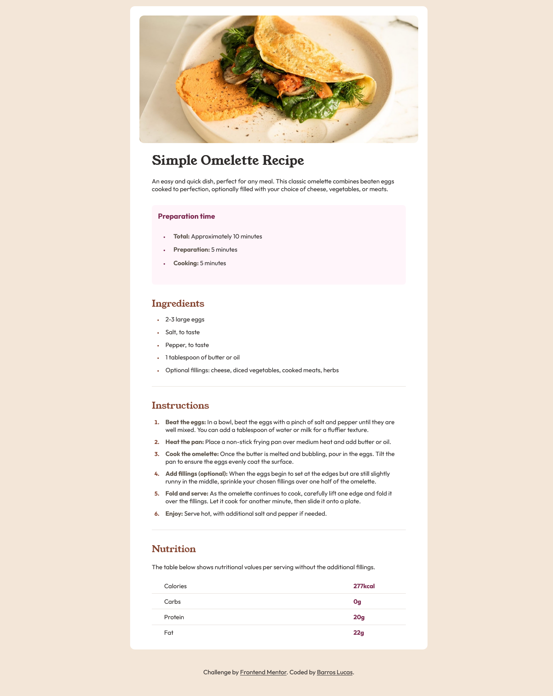

# Frontend Mentor - Recipe page solution

This is a solution to the [Recipe page challenge on Frontend Mentor](https://www.frontendmentor.io/challenges/recipe-page-KiTsR8QQKm). Frontend Mentor challenges help you improve your coding skills by building realistic projects. 

## Table of contents

- [Overview](#overview)
  - [Screenshot](#screenshot)
  - [Links](#links)
- [My process](#my-process)
  - [Built with](#built-with)
  - [Useful resources](#useful-resources)
- [Author](#author)

## Overview

### Screenshot

### Links

- Solution URL: [Solution URL](https://github.com/BarrosLucasJavier/recipe-page-main)
- Live Site URL: [Site URL](https://barroslucasjavier.github.io/recipe-page-main/)

## My process

### Built with

- Semantic HTML5 markup
- CSS custom properties
- Flexbox
- Mobile-first workflow

### Useful resources

- [Mozilla Docs](https://developer.mozilla.org/es/docs/Web) - Me ayudo a reforzar conceptos.

## Author

- Repository - [BarrosLucasJavier](https://github.com/BarrosLucasJavier)
- Frontend Mentor - [@BarrosLucasJavier](https://www.frontendmentor.io/profile/BarrosLucasJavier)

